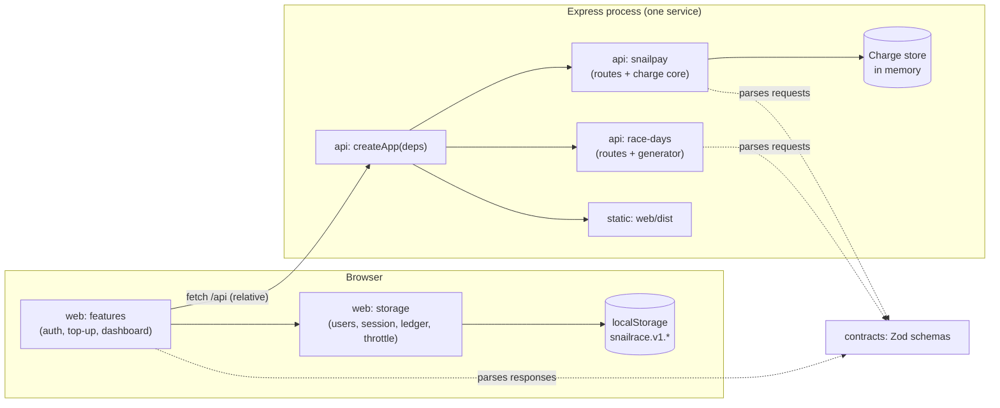

# Architecture

How the codebase is organized so responsibilities stay separated and the frontend and backend share one contract. Terms follow [`CONTEXT.md`](../CONTEXT.md). This was decided in the ticket [Define the system architecture: monorepo layout, layering and shared contracts](https://github.com/TadeoOL/tadeo-5396/issues/12).

Library choices for the frontend (routing, server state, forms, UI kit, charts) are in [the frontend stack](specs/frontend-stack.md). The request and response bodies of SnailPay belong to the SnailPay contract. This document fixes only the structure they fit into.

## Components



## Repository layout

npm workspaces, with three packages:

```
apps/
  web/          @snailrace/web        React SPA, built with Vite
  api/          @snailrace/api        Express server
packages/
  contracts/    @snailrace/contracts  Zod schemas and constants shared by both
```

- The workspace split keeps the DOM types and the Node types in separate `tsconfig`s, and it stops `web` from importing server code.
- Each package extends the shared base `tsconfig` from [`conventions.md`](conventions.md).
- **Commit scopes**: `web`, `api`, `contracts`. Omit the scope for changes that span packages or live at the root.

## Runtime and build

- **`api` and `contracts` run as TypeScript source**, using Node 24's built-in type stripping. There is no build step for them. See [ADR 0002](adr/0002-run-typescript-with-node-type-stripping.md).
  - Dev: `node --watch src/server.ts`. Prod: `node src/server.ts`.
  - `contracts` exports `./src/index.ts` directly. Node resolves the workspace symlink to its real path, so type stripping applies. This was checked on Node 24.15.
  - Relative imports use the `.ts` extension (`allowImportingTsExtensions` with `noEmit`). Type-only imports use `import type` (`verbatimModuleSyntax`).
- **`web` is the only package with a build**: `vite build` writes `apps/web/dist`. In production, Express serves that folder as static files and returns `index.html` for any non-`/api` route (the SPA fallback). The path is resolved from `app.ts`'s own location ([Deployment](deployment.md#serving-the-web-app)).
- **`typecheck`** runs `tsc --noEmit` in each workspace.

## Scripts

| Root script | What it does                                                                                                                  |
| ----------- | ----------------------------------------------------------------------------------------------------------------------------- |
| `dev`       | Runs the API (`node --watch`, port 3000) and Vite (port 5173) together with `concurrently`. Vite proxies `/api` to port 3000. |
| `build`     | Runs `vite build` for `web`. The other packages have nothing to build.                                                        |
| `start`     | Starts the API. With `NODE_ENV=production` it also serves `apps/web/dist` ([Deployment](deployment.md#serving-the-web-app)).  |

The other root scripts (`typecheck`, `lint`, `format`, `test`, `check`) are defined in [`conventions.md`](conventions.md).

- **Why `concurrently`**: `npm run dev --workspaces` runs scripts one after another, so the first server blocks the second. `&` in a script does not run processes in parallel under Windows' `cmd`.
- **Rejected alternative**: mounting Vite in middleware mode inside Express. It would need one process and no new dependency, but `api` would depend on `vite`, and every API restart would also restart the frontend dev server.

## Shared contracts

`@snailrace/contracts` contains **only Zod 4 schemas and constants, no logic**. Types are inferred with `z.infer`, so a schema and its type cannot drift.

It contains:

- The Charge request and response schemas, with the shape defined by the SnailPay contract.
- The Race Day and Bets response schemas from the [simulated data spec](specs/simulated-data.md).
- The error envelope (see [Errors and logging](#errors-and-logging)).
- `HealthResponse`: `{ status: "ok" }`, the body of `GET /api/health`.
- Shared primitives: `IsoDate`, `Uuid`, and the Top-up amount limits.
- `ScenarioCard`: a `z.enum` of the Scenario card numbers. SnailPay uses it to decide which cards it echoes unmasked, and the Top-up dialog lists its `.options` as test cards ([Screens](design/screens.md#top-up-dialog)).

Each side uses the schemas like this:

- **`api` parses every request** (body, params and query) before it reaches a feature's core.
- **`web` parses every response** before using it. This matters most for the Charge response, which is stored verbatim in the ledger: a malformed response must never get there.
- **The Top-up form validates the amount with the same limits** the API enforces.

Not in `contracts`:

- The localStorage schemas. They never cross the network, so they live in `web/src/storage`.
- The race-day generator. It runs only on the server, so it lives in `api`.

## Backend

Folders by feature. Each feature has a thin HTTP layer over a core that is pure where it can be.

```
apps/api/src/
  server.ts          reads config, calls createApp, listens
  app.ts             createApp(deps): middleware, feature routers, static files, error handler
  config.ts          reads and validates process.env once
  http/              request id, request logging, error handler
  snailpay/
    routes.ts        HTTP only: parse with contracts, call the core, map the result to a status; its own error handler answers 500 in the Charge shape
    charges.ts       the core: decide the Charge from the Scenario, idempotent replay, lookup by reference
    charge-store.ts  the in-memory store of Charges
  race-days/
    routes.ts
    generator.ts     pure and deterministic (see the simulated data spec)
```

- **`routes.ts` only translates HTTP.** It never decides an outcome. Business rules live in the core, which could be tested without Express; the [testing strategy](testing.md) tests it through HTTP instead, which is just as fast and also checks the contract.
- **`createApp(deps)` receives what changes between tests**: the Charge store (a fresh one per test) and a `sleep` function, which the timeout Scenario uses to wait. Tests pass a `sleep` that resolves immediately. `server.ts` passes the real ones. Per-app state such as the rate limiter is created inside `createApp`, so each test starts fresh.
- **No port interfaces.** Each dependency has one real implementation, so a port would be a hypothetical seam. The database proposal is written only; it does not add a second adapter.
- There is no separate "application service" or "infrastructure" layer. For two features, those layers would only pass calls through.

## Frontend

Folders by feature, with container and presentational components, and one storage module in front of localStorage.

```
apps/web/src/
  main.tsx, app/     entry point, providers, routes
  features/
    auth/
    top-up/
    dashboard/
  storage/           users, session, ledger, throttle: schemas, read/write rules, change subscription
  api/               fetch wrappers that parse responses with contracts
```

- **Container and presentational.** In each feature, a container connects to hooks, `storage` and `api`. The presentational components it renders receive everything through props and have no side effects.
- **`storage` is a deep module.** Its interface is small (for example `readLedger`, `startTopUp`, `settleTopUp`, `subscribe`, plus the equivalents for Users and the Session). Behind it are every rule from the [state and persistence spec](specs/state-and-persistence.md): read-modify-write, write-ahead, the allowed outcome transitions, crediting once, the invariant check, schema validation and the `storage` event.
- **The seam is the standard Web Storage `Storage` interface.** The `storage` module receives a `Storage` object: `window.localStorage` in the app, and an in-memory `Storage` in tests. No custom repository interface is added, because `Storage` already has two real adapters.
- Features never call `localStorage` or `fetch` directly.

## Configuration

- **API**: `config.ts` reads `process.env` once at startup, validates it, and exits with a clear message if a value is invalid.
  - `PORT`: set by the host; defaults to 3000. The server listens on `0.0.0.0`.
  - `NODE_ENV`: `development` or `production`. Render sets `production` at runtime ([Deployment](deployment.md#environment)).
- **Web**: no `VITE_*` variables. It always calls a relative `/api`: in production the API is the same service, and in dev Vite proxies it.
- **No `.env` files and no dotenv.** If one is ever needed, Node 24 has `--env-file-if-exists`.
- The delay of the timeout Scenario is a constant of the mock, not configuration. Tests control it by injecting `sleep`.

## Errors and logging

- **Request id**: taken from the `X-Request-Id` request header if it is a UUID; otherwise generated with `crypto.randomUUID()`. It is returned in the `X-Request-Id` response header.
- **Error envelope** for every error that is not a SnailPay payment response:

  ```json
  { "error": { "code": "invalid_request", "message": "…", "requestId": "…" } }
  ```

  The race-day endpoints use it for their `400`s. The SnailPay contract defines the bodies of its own error responses.

- **One central error-handling middleware** for the non-SnailPay routes. An unexpected error responds `500` with the envelope and code `internal_error`.
- **The SnailPay router has its own error handler.** An unexpected error there responds `500` in the Charge shape, with `status: "error"` and `status_detail: "internal_error"`, and no Charge is stored ([SnailPay API](specs/snailpay-api.md#status-catalog)).
- In both cases the stack trace is logged, never returned.
- **Request log**: one JSON line per request, written with `console`, with `requestId`, `method`, `path`, `status` and `durationMs`.
- **Request bodies and query strings are never logged, for any route.** Card data therefore cannot reach a log, and there is no redaction list to keep up to date.
- Security middleware (`helmet`, body limit, rate limits, `trust proxy`) is specified in the [security baseline](specs/security.md#express).
- The frontend has no remote logging. It shows errors to the User as described by the screen designs.
