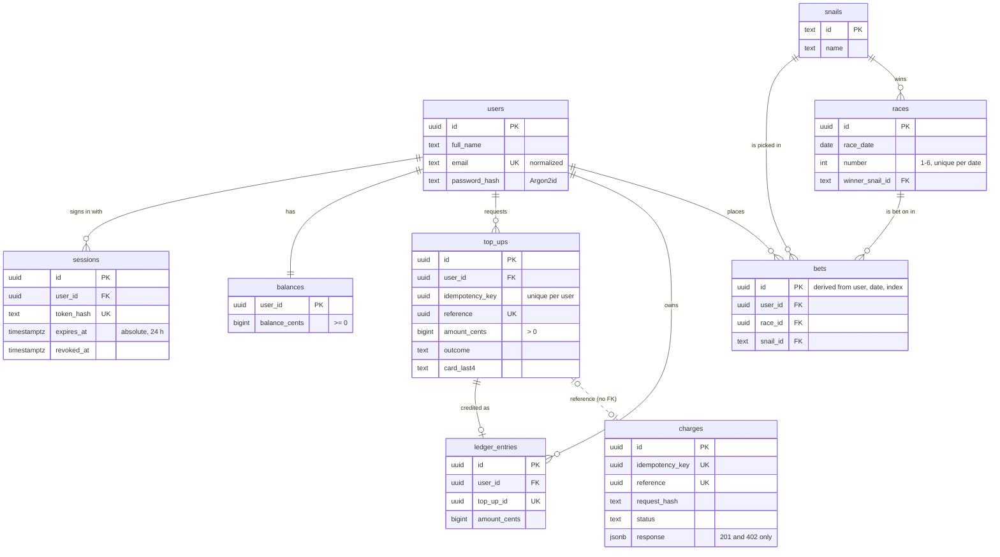

# Database proposal

The delivered app keeps the User, the Session and the Balance in localStorage, as the brief requires ([ADR 0001](adr/0001-browser-as-ledger.md)). This proposal describes the next step, a server-side database. It is not implemented. Terms follow [`CONTEXT.md`](../CONTEXT.md).

## Technology

**PostgreSQL**, managed by the same provider as the web service, accessed through **Drizzle ORM** with `drizzle-kit` SQL migrations.

- **PostgreSQL** gives ACID transactions to credit a Top-up and move the Balance together, constraints that enforce idempotency and a non-negative Balance, and `ON CONFLICT` for replay-safe inserts. SQLite does not suit several API instances, and a document store gives up the constraints and joins this design relies on.
- **Drizzle** defines the schema in plain TypeScript with no codegen step, so it runs under Node type stripping ([ADR 0002](adr/0002-run-typescript-with-node-type-stripping.md)). Prisma was rejected for its separate schema language and generated client.

## Entities and relationships

- **Identity.** `users` holds the profile and the password hash (1:1, so no separate credentials table). `sessions` holds a hash of the opaque session token, never the token itself.
- **Money.** `ledger_entries` is append-only and is the source of truth: the Balance is the sum of a User's entries. `balances` is a materialized copy that the database constrains. `top_ups` records every attempt and its Top-up outcome.
- **SnailPay** lives in its own `snailpay` schema in the same instance. It stands for an external provider's database, so nothing references it by foreign key; `reference` is the only link. The idempotency keys live on `charges`, so they need no table of their own.
- **Racing.** `snails` has six fixed rows. A Win, and whether a Bet is won or lost, are derived by comparing `bets.snail_id` with `races.winner_snail_id`, never stored.

## Guarantees enforced by the database

- **One Top-up per retry.** A unique key on the User and idempotency key makes a repeated `POST` return the existing Top-up.
- **Credited at most once.** Crediting is one transaction that moves the Top-up from pending or unknown into credited, appends its ledger entry and adds to `balances`. The unique key on `ledger_entries.top_up_id` rejects a second credit, even from a replayed approval.
- **Non-negative Balance.** A check constraint on `balance_cents`. Top-ups only add today, and the same rule will hold if Bets ever carry an amount and debit the ledger.
- **SnailPay idempotency.** Unique keys on the idempotency key and on `reference`. A reused key with a different request hash is answered with `422`, as specified today.
- **Congruent races.** A unique key on the race date and number, a check that the number is between 1 and 6, and a required winner.
- **Card data.** The CVV is never stored, and only the last 4 digits of the number are kept. Keeping the full card and CVV in localStorage is an artifact of the simulation that the brief requires, not something to carry into a database.

## Changes

**Backend**

- New endpoints: `POST /api/auth/sign-up`, `POST /api/auth/sign-in` (sets the cookie), `POST /api/auth/sign-out`, `GET /api/me` (User and Balance), `POST /api/top-ups` (with `X-Idempotency-Key`) and `GET /api/top-ups`.
- The server orchestrates Top-ups. It records the Top-up as pending, calls SnailPay server to server, and credits the Top-up in the same transaction when the Charge is approved.
- Reconciliation becomes an in-process job. It looks up Top-ups that are unknown, or pending for longer than the request timeout, using the existing backoff and settlement rules.
- Sessions use an opaque token in an `HttpOnly; Secure; SameSite=Lax` cookie, with the 24 h absolute expiry kept. Sign-out revokes the Session on every device. Passwords are hashed with Argon2id on the server.
- The two race GET endpoints keep their shape, but they read from the database and are scoped to the Session's User instead of taking a `userId`. Races are written once per date, and each Bet id is derived deterministically, so repeated generation inserts nothing new.
- `createApp(deps)` gets Drizzle-backed stores in place of the in-memory Charge store. Tests keep injecting the in-memory versions.

**Frontend**

- Remove the `storage` ledger, browser-side PBKDF2, client Reconciliation and the `storage` event listener.
- The Balance and history become TanStack Query server state, invalidated after each Top-up. The route guards ask `GET /api/me`.
- The `fetch` wrapper needs no change: the API is same-origin, so cookies are sent by default.

**Data migration**: none. Existing localStorage data comes from a local simulation and is discarded.
