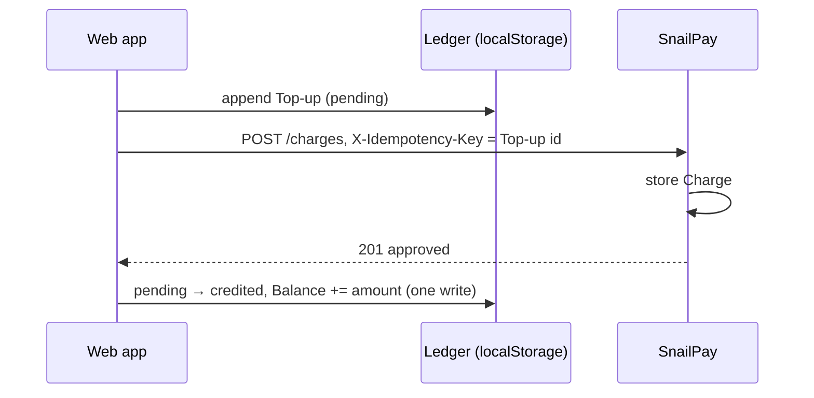
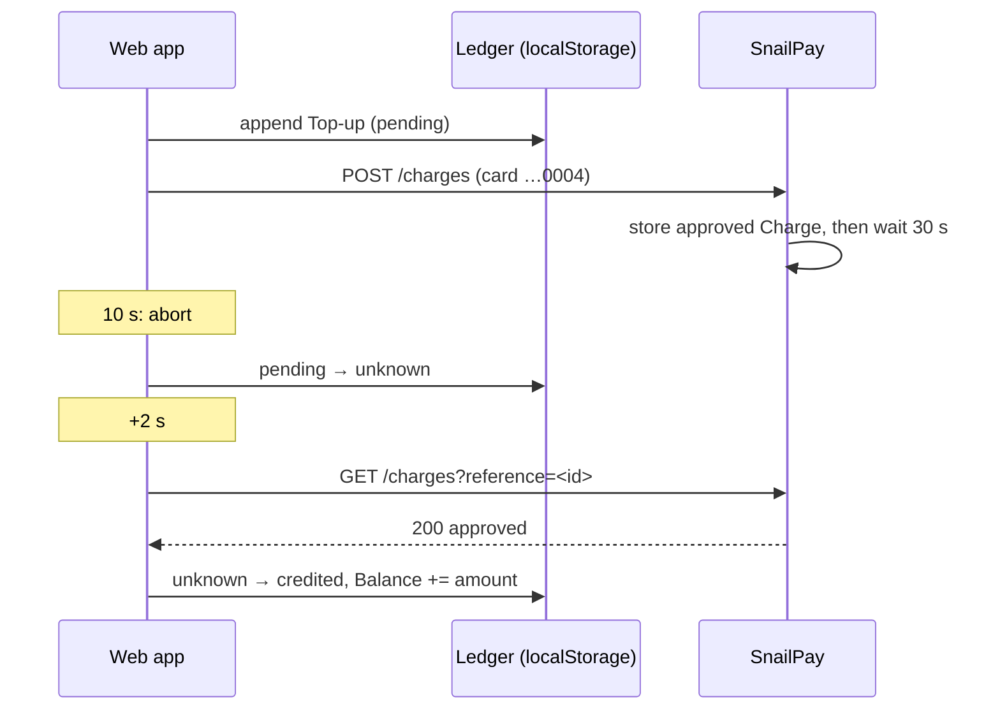
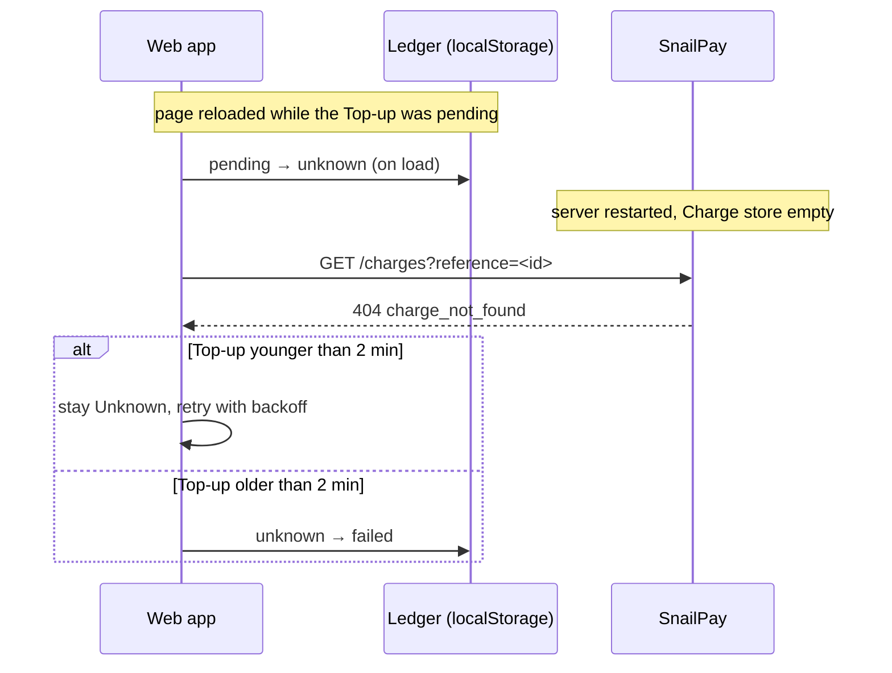

# Top-up reliability

How a Top-up credits the Balance exactly once, and never on a declined, failed or unknown outcome, under timeouts, retries, double clicks, reloads and server restarts. Terms follow [`CONTEXT.md`](../../CONTEXT.md). This spec builds on the ledger rules in [State and persistence](state-and-persistence.md) and the contract in [SnailPay API](snailpay-api.md).

## Guarantees and where they come from

| Guarantee | Mechanism |
|---|---|
| No second Charge for the same Top-up | The Top-up `id` is the `X-Idempotency-Key`; SnailPay replays stored results for the same key |
| The Balance is credited at most once | Ledger rule 4: only the transition into `credited` adds to the Balance, in the same write |
| Never credited on a failure or an unknown result | Only a parsed `approved` Charge moves a Top-up into `credited` |
| An unknown result is eventually settled | Reconciliation looks the Charge up by `reference` |
| A lost request is never mistaken for a failure too early | A `404` settles as Failed only after the Top-up is 2 minutes old |

## Idempotency key

- **Generated once per submission**: `crypto.randomUUID()` runs in the submit handler, never during render. The value becomes the Top-up `id`, the `X-Idempotency-Key` and the Charge `reference`.
- **Scope**: one Top-up. The client never sends the same key for a different Top-up, so `422 idempotency_key_reused` never happens from the UI.
- **Lifetime**: on the client, as long as the ledger (the Top-up keeps its `id`). On the server, until the process restarts (the Charge store is in memory and uncapped).
- **Replay semantics** are defined by the SnailPay contract: the same key and payload returns the stored `201`/`402` with `Idempotent-Replayed: true`; a different payload returns `422`; `400`, `422`, `429`, `500` and `503` are not stored.

## Submitting a Top-up

1. The User submits the form. The handler generates the key and appends the Top-up as `pending` (write-ahead, no card data).
2. The submit button stays disabled while a Top-up of this tab is `pending`, so a double click cannot create a second Top-up.
3. The client sends `POST /api/snailpay/charges` with `AbortSignal.timeout(10_000)`.
4. The response is mapped to an outcome with the table below, and the Charge response is stored with the Top-up in the same write.

The **client timeout is 10 seconds**. A normal response is immediate, and the timeout Scenario answers after 30 seconds, so the Scenario always ends in a timeout. Waking a sleeping server is not the timeout's job: the deployment decides how the app calls `/api/health` before the form is used.

**Concurrency.** An Unknown Top-up does not block a new one; each Top-up is independent. Tabs share no lock: two tabs submitting at once create two legitimate Top-ups with different keys, and two tabs reconciling the same Top-up cannot credit it twice because of ledger rule 4.

## Response → outcome

| `POST` result | Outcome |
|---|---|
| `201 approved` | Credited |
| `402 rejected` | Declined |
| `503`, `500` or `429` with a valid SnailPay body | Failed |
| `400` or `422` with a valid SnailPay body | Failed (a client bug: the form validates the same rules and keys are never reused) |
| Timeout or network error | Unknown |
| Any status whose body does not parse as a SnailPay response (for example, a `502`/`504` HTML page from the hosting proxy) | Unknown |
| A body whose `reference` differs from the Top-up `id` | Unknown |

**Only a result we can read with certainty is final.** Failed is final, so anything ambiguous goes to Unknown instead: a proxy error or a timeout can arrive *after* Express has already approved the Charge.

A Failed Top-up is never retried. If the User tries again, that is a **new Top-up with a new key**, so every Top-up still maps to exactly one Charge.

**What the User sees** (the copy belongs to the screen design):

- **Unknown**: the payment is not confirmed yet and is being checked; the Balance does not change until it is confirmed. It is never presented as an error.
- **Failed**: SnailPay could not process the payment and nothing was charged; the User can try again.

## Reconciliation

The `POST` is never retried automatically. Reconciliation is the only retry, and it only reads: `GET /api/snailpay/charges?reference=<topUpId>`. It works the same in the tab that submitted and after a reload, when the card data is gone.

### When it runs

- Right after a Top-up becomes Unknown.
- On app load and on sign-in, for each Unknown Top-up of the signed-in User. Load first turns every `pending` Top-up into `unknown` (ledger rule 6).
- When the User presses "Check again" on an Unknown Top-up in the history.

### Backoff

Within one run, attempts happen 2, 4, 8, 16 and 32 seconds after the previous one (5 attempts, about one minute). When a `503` or `429` carries `Retry-After`, the next attempt waits the longer of the two. After the fifth attempt the run stops and the Top-up stays Unknown until the next trigger. The backoff lives in memory; it is not persisted.

No jitter: there are no fleets of clients to desynchronize. `ponytail:` add jitter if many clients ever reconcile against one server.

### Lookup result → action

| Lookup result | Action |
|---|---|
| `200` with `status: approved` | Credited (stores the Charge response) — stop |
| `200` with `status: rejected` | Declined (stores the Charge response) — stop |
| `404` and the Top-up is **older than 2 minutes** (`now − createdAt`) | Failed — stop |
| `404` and the Top-up is younger | Stay Unknown — retry |
| `503`, `500`, `429`, timeout, network error, unparseable body | Stay Unknown — retry |

**Why the 2-minute rule.** A `404` means one of three things: the `POST` never reached the server, the server restarted and forgot the Charge, or the `POST` has not been processed *yet*. The third case is real on the hosting tier: during a cold start of about a minute, the client aborts after 10 seconds while the `POST` is still queued, and the lookup may be served before it. Two minutes is longer than the timeout Scenario's 30 seconds and a cold start, so an old `404` can only mean the Charge will never exist. The threshold uses `createdAt`, which is already persisted, so the rule survives reloads with no extra state.

**Known ceiling.** A real gateway persists its Charges, so a late `404` would mean the request never arrived. In the mock, the server's memory is SnailPay's only record, so "forgotten after a restart" is treated as "no money moved".

## Sequences

### Approved

### Timeout Scenario

### Reload after a server restart

## Rate limiting

Whether a rate limiter exists, and its limits, is decided by the security baseline. If it does:

- A `429` on the `POST` means the request was rejected before processing: no Charge was created, so the Top-up is Failed.
- A `429` on the lookup keeps the Top-up Unknown and is retried, honoring `Retry-After`.
- The `429` must use the Charge response shape (`status: error`, `status_detail: rate_limited`) with a `Retry-After` header, and it is not stored for replay.
- The lookup limit must allow the five-attempt backoff for each Unknown Top-up.

## Rejected alternatives

### Async processing (`in_process` with an in-memory queue)

SnailPay could answer `202 in_process` and settle the Charge in a background worker. It is rejected:

- The Balance lives in the browser, so a server worker cannot credit anything. The client would have to poll for the result, and that polling already exists: it is Reconciliation.
- An in-memory queue is lost whenever the hosting tier sleeps or redeploys, which would create more Unknown Top-ups, not fewer.
- The only slow path is the timeout Scenario, and it already settles by lookup because the Charge is stored before the delay.

Adding the status later is cheap, so this is not recorded as an ADR.

### Replaying the `POST` with the same key

The textbook recovery for an unknown result is to resend the `POST` with the same idempotency key: a stored Charge is replayed, and a missing one is processed now. It is rejected because the card data is not stored until a response arrives, so after a reload only a lookup is possible anyway. Replaying would add a second recovery path, and it would keep card data in memory, to cover only the case without a reload. The server still honors idempotent replays, which protect against duplicate submissions.
